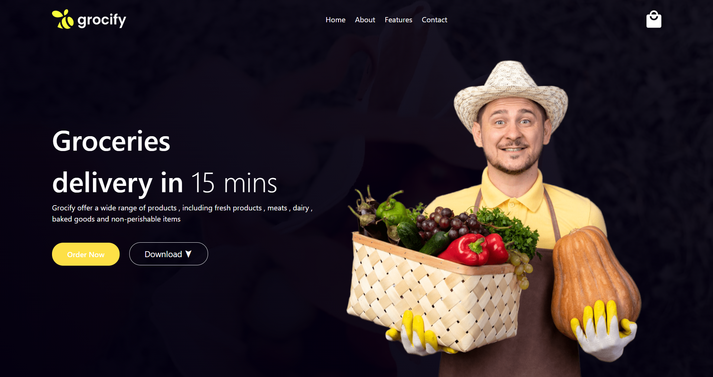

# 🌿 Tailwind Landing Page Project

A simple and responsive **Landing Page** built using **Tailwind CSS**.
This project is a grocery delivery website interface designed with modern styling and responsive layout using Tailwind utility classes.

This is my **first Tailwind CSS project as a beginner**, created to learn how Tailwind works and how to build clean user interfaces without writing traditional CSS.

---
## 🚀 Features
* 🎨 Modern landing page design
* 📱 Responsive layout
* ⚡ Fast styling using Tailwind utilities
* 🧭 Navigation bar with links
* 🖼️ Background image design
* 🛒 Grocery delivery theme
* 🖱️ Hover animations
* 🧠 Built using Tailwind CDN

---
## 🛠️ Technologies Used
* HTML5
* Tailwind CSS (CDN Version)

---

## 📂 Project Structure
```
Tailwind-Landing-Page/
│
├── index.html
├── images/
│   ├── logo.png
│   ├── cart.png
│   ├── grocery-image.png
│   └── image.png
│
└── README.md
```
---
## ⚙️ How It Works

### 1️⃣ Layout Structure
The page contains:
* Navigation bar
* Logo
* Menu links
* Shopping cart icon
* Heading section
* Description text
* Buttons
* Product image

---
### 2️⃣ Tailwind Styling
Tailwind classes are used for:
* Spacing
Example:
```
px-28 py-5
```
Controls padding.
---
* Colors
Example:
```
text-white
bg-yellow-300
```
Controls text and background colors.
---
* Flexbox Layout

Example:

```
flex items-center
```
Aligns elements in a row.
---
* Responsive Design
Example:
```
xl:w-1/2
```
Changes layout on large screens.
---

### 3️⃣ Buttons
Two buttons are included:

**Order Now Button**
* Rounded design
* Yellow background
* Hover effects

**Download Button**
* Border style
* Hover animation
* Bounce effect

---

### 4️⃣ Background Image
The page uses a background image.
Example:
```
bg-[url('images/image.png')]
bg-cover
bg-center
```
---
## ▶️ How to Run the Project
1. Download or clone the repository:
```
git clone https://github.com/takundagorogodo/tailwind-landing-page.git
```
2. Open the project folder.
3. Open `index.html` in your browser.
No installation required.

Tailwind works directly from CDN.
---

## 🖼️ Screenshot
```
screenshot.png
```
Example:

---

## 🎯 What I Learned
* Introduction to Tailwind CSS
* Utility-first CSS
* Flexbox layout
* Responsive design
* Tailwind spacing system
* Tailwind colors
* Hover effects
* Using Tailwind CDN
* Building UI without CSS files

---
## 📌 Future Improvements
* Add mobile menu
* Add more pages
* Improve responsiveness
* Add animations
* Add footer
* Convert to React
* Deploy on GitHub Pages

---

## 👨‍💻 Author

Takundah Gorogodo

CSE Student | Machine Learning Enthusiast

---
## 📄 License

This project is open-source and available for learning and educational purposes.

---
